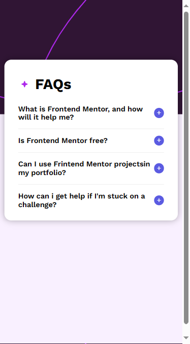

## Table of contents

- [Overview](#overview)
  - [The challenge](#the-challenge)
  - [Screenshot](#screenshot)
  - [Links](#links)
- [My process](#my-process)
  - [Built with](#built-with)
  - [What I learned](#what-i-learned)
- [Author](#author)

## Overview

### The challenge

Users should be able to:

- Hide/Show the answer to a question when the question is clicked
- Navigate the questions and hide/show answers using keyboard navigation alone
- View the optimal layout for the interface depending on their device's screen size
- See hover and focus states for all interactive elements on the page

### Screenshot

### Links

- Solution URL: [Add solution URL here]([https://your-solution-url.com](https://github.com/ZaiBerm/FEM-FAQ_Accordion))
- Live Site URL: [Add live site URL here](https://ZaiBerm.github.io/FEM-FAQ_Accordion)

## My process

### Built with

- Semantic HTML5 markup
- CSS custom properties
- Flexbox
- Jvascript

### What I learned

This is my first time doing DOM manipulation and javascript, i learned so many things such as using Javascript to manipulate the text content of an element, to change the css properties, I also learrned a little bit about how the functions work in Javascript. This is by far the most satifying project I did on html/css/javascript :>>

## Author

- Frontend Mentor - [@ZaiBerm](https://www.frontendmentor.io/profile/ZaiBerm)
- Instagram - [@Zxirus](https://www.instagram.com/zxirus/)
- Facebook - [Zairus Bermillo](https://web.facebook.com/zairus.bermillo.9)

